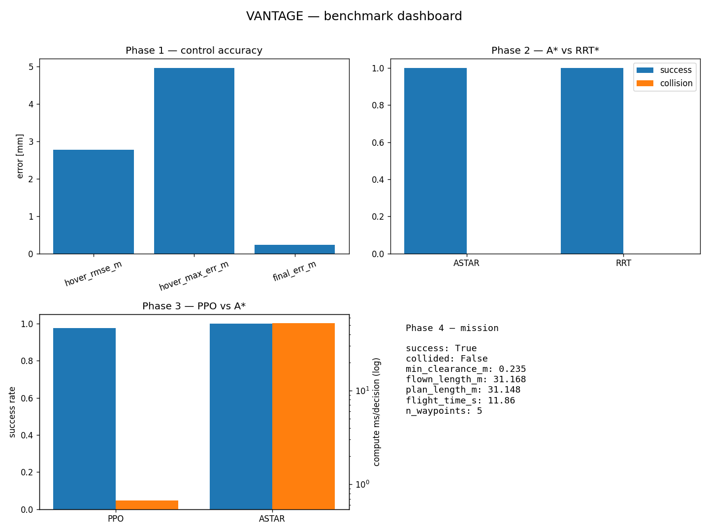
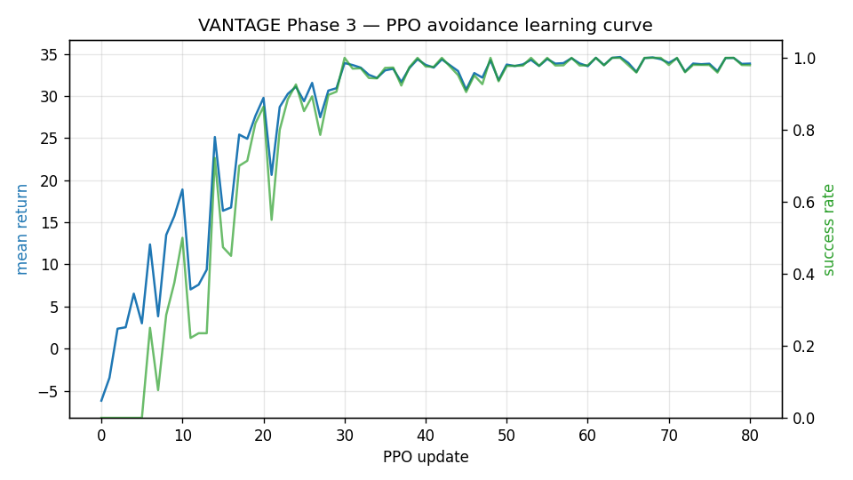
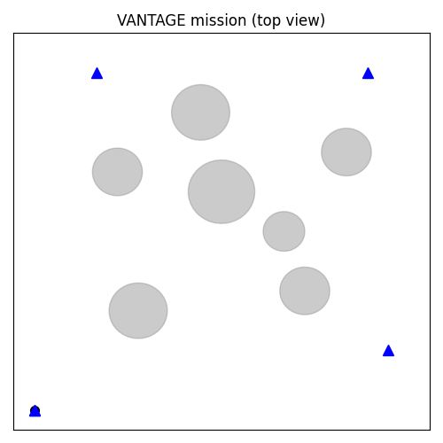

# VANTAGE

**Versatile Autonomous Navigation & Tracking in GPS-denied Environments**

A sim-first, modular autonomous drone stack. VANTAGE flies a quadrotor through cluttered, GPS-denied environments using only onboard cameras and an IMU — it **sees** (deep-learning perception), **knows where it is** (visual-inertial SLAM), and **decides how to move** (planning + a reinforcement-learning collision-avoidance policy). Everything is proven in high-fidelity simulation first and built to port to real hardware.

> One project that spans the three things drone companies hire interns for: **perception**, **state estimation / navigation**, and **planning & control**.

-success)    

---

> **Full documentation:** see **[DOCS.md](DOCS.md)** — every folder/file explained, all phases, methods & why, the PX4 comparison, and how training was done.

## Two simulators (read this first)

VANTAGE has two ways to "run":

1. **Headless physics sim (this repo's `vantage/` package)** — integrates real
   quadrotor dynamics in code and outputs **metrics, plots, and a demo GIF** in
   `results/`. It does not pop open a 3D window; you see the *recording*. This is
   what produces all the benchmark numbers below and runs in CI.
2. **3D simulator (`realsim/`)** — PX4 SITL + Gazebo in WSL2, a real-time 3D
   window where you watch the drone fly. See **[realsim/00_RUNBOOK.md](realsim/00_RUNBOOK.md)**.

## Results (sim, reproducible)

All numbers below are produced by the scripts in `scripts/` and saved to `results/`
as committed `.md`/`.csv` + plots. Regenerate everything with:

```bash
pip install -e .
pytest -q                              # 12 tests
python scripts/phase1_hover.py         # control
python scripts/phase2_planning_benchmark.py   # A* vs RRT*
python scripts/phase3_train.py --resume       # train PPO (or phase3_train_torch.py on a GPU)
python scripts/phase3_benchmark.py     # PPO vs A*
python scripts/phase4_mission.py       # full mission + demo GIF
python scripts/run_all_benchmarks.py   # docs/BENCHMARKS.md + dashboard
```



**Phase 1 — control:** takeoff + hover to **2.8 mm** RMSE, 1 m step settles in **1.32 s**.

**Phase 2 — global planning (A\* vs RRT\*, 15 random worlds):** both **100% success, 0 collisions**; flown paths ~13 m vs ~13 m straight-line optimum.

| planner | success | collision | len (m) | plan (ms) |
|---|---|---|---|---|
| A* | 1.00 | 0.00 | 13.0 | 67 |
| RRT* | 1.00 | 0.00 | 13.8 | 49 |

**Phase 3 — learned avoidance (PPO from scratch).** GPU-trained on the **RTX 4050**: **96% success / 4% collision** over 100 randomized courses (`results/phase3_torch_eval.txt`). Benchmarked vs A\* (40 worlds): the reactive policy reaches **97% success** at **0.68 ms/decision** with *no map*, vs A\* at 100% / 52 ms with a full map — reactivity-vs-optimality, quantified.



**Phase 4 — full autonomous mission** (takeoff → inspect 3 points → return-to-home), planned per-leg with A\* and flown closed-loop. Flown length **31.17 m** vs planned **31.15 m** (near-perfect tracking), 0 collisions.



> Built incrementally — the git history includes the real bugs I hit and fixed
> (Euler→RK4 integration drift, controller gain tuning, follower overshoot,
> a PPO policy-gradient broadcast error, RNG nondeterminism, and self-intersecting
> path-following). See `docs/BENCHMARKS.md` for the full report.

## Why this project

Drone-autonomy internships (Skydio, Zipline, Anduril, Wing, and smaller startups) repeatedly ask for the same core skills: computer vision, GPS-denied localization & mapping, motion planning, control, and increasingly RL + sim-to-real. VANTAGE is built on the intersection of those skills, so a single codebase demonstrates fit for almost any of these roles — you just emphasize the module that matches the posting.

## Architecture

```
Cameras + IMU
     │
     ▼
[M1 Perception]  depth + obstacle detection (PyTorch / TensorRT)
     │
     ▼
[M2 State Estimation]  VIO fused with IMU via PX4 EKF2  (GPS disabled)
     │
     ▼
[M3 Mapping]  3D occupancy grid / ESDF
     │
     ▼
[M4 Planning]  global A*/RRT*  +  local MPC / minimum-snap
     │
     ▼
[M5 Learning]  RL collision-avoidance policy (Isaac Lab)  ⇄ benchmarked vs. M4
     │
     ▼
[Control]  PX4 flight controller  →  Motors
```

## Modules

| # | Module | What it does | Maps to role |
|---|--------|--------------|--------------|
| M0 | Simulation & infra | Isaac Sim + Pegasus + PX4 SITL + ROS 2 bridge, logging, CI | Embedded / systems |
| M1 | Perception | Monocular/stereo depth + YOLO-class obstacle detection + segmentation | Perception / CV |
| M2 | State estimation | Visual-inertial odometry fused with IMU (EKF2), GPS-denied pose hold | SLAM / sensor fusion |
| M3 | Mapping | Real-time 3D occupancy / ESDF map | SLAM / navigation |
| M4 | Planning | Global path planner + local trajectory optimizer (MPC / min-snap) | Controls / planning |
| M5 | Learning policy | RL collision avoidance in Isaac Lab + domain randomization (sim-to-real) | Autonomy / RL |
| M6 | Missions & eval | Behavior-tree missions + automated benchmark suite | Generalist autonomy |

## Tech stack

- **Simulator:** NVIDIA Isaac Sim 5.x + [Pegasus Simulator](https://github.com/PegasusSimulator/PegasusSimulator) (Gazebo Harmonic as fallback)
- **Flight stack:** PX4 Autopilot (SITL); ArduPilot kept as autopilot-agnostic option
- **Middleware:** ROS 2 (Jazzy/Humble), uXRCE-DDS bridge, MAVSDK-Python
- **Perception:** PyTorch, YOLO-class detector, depth/segmentation model, OpenCV, ONNX/TensorRT
- **Estimation:** VIO (VINS-Fusion / OpenVINS style) → PX4 EKF2
- **Mapping:** OctoMap / Voxblox-style occupancy + ESDF
- **Planning & control:** A*/RRT*, MPC / minimum-snap, geometric control
- **Learning:** Isaac Lab, PPO/SAC, domain randomization
- **Tooling:** Docker, GitHub Actions CI, rosbag2, RViz2 / Foxglove, Weights & Biases

## Roadmap (12 weeks, sim-only)

| Weeks | Phase | Artifact |
|-------|-------|----------|
| 1–2 | M0 Foundation | Drone arms + holds position via ROS 2; Docker + CI scaffolded |
| 3–4 | M1 Perception | Live depth + obstacle detection; first demo GIF |
| 4–6 | M2 Estimation | GPS-denied square flight on VIO+EKF2; trajectory vs. ground-truth plot |
| 6–7 | M3 Mapping | Real-time 3D map in RViz2 |
| 7–9 | M4 Planning | Autonomous A→B flight avoiding static obstacles; logged metrics |
| 9–11 | M5 RL policy | Trained avoidance policy; head-to-head vs. classical planner |
| 11–12 | M6 Missions & polish | Behavior-tree mission, benchmark report, demo reel |

**Minimum viable version:** M0–M2 + M4. **Standout add:** M5 (RL policy).

## Repository layout (planned)

```
vantage/
├── docker/                 # Reproducible dev environment
├── sim/                    # Isaac Sim / Pegasus worlds + PX4 SITL config
├── vantage_perception/     # M1 — ROS 2 pkg
├── vantage_estimation/     # M2 — VIO + EKF2 config
├── vantage_mapping/        # M3 — occupancy / ESDF
├── vantage_planning/       # M4 — global + local planners
├── vantage_rl/             # M5 — Isaac Lab envs + trained policies
├── vantage_missions/       # M6 — behavior trees + benchmark suite
├── docs/                   # architecture diagram, write-ups
└── .github/workflows/      # CI
```

## Getting started (target workflow)

```bash
# 1. Clone
git clone https://github.com/samisaliveagain/vantage.git && cd vantage

# 2. Build the dev container (ROS 2 + PX4 SITL)
docker compose up --build

# 3. Launch sim + autopilot bridge
ros2 launch vantage_sim sitl.launch.py

# 4. Take off (GPS disabled) and run a mission
ros2 launch vantage_missions search_inspect_return.launch.py
```

*(Commands are the planned interface; implemented module-by-module per the roadmap.)*

## Deliverables

- Clean monorepo with per-module READMEs + architecture diagram
- 60–90s demo reel (takeoff → GPS-denied flight → avoidance → RL-vs-classical)
- Technical write-up on the sim-to-real RL experiment with benchmark numbers
- Metrics table: success rate, collision rate, path length, compute cost
- One-command Dockerized reproduction

## Stretch goals

- Multi-drone / swarm coordination (Aerostack2 behavior trees)
- Natural-language mission commands via an LLM front-end
- Port perception + VIO to a real sub-$300 drone / Jetson companion
- Neural scene reconstruction (3D Gaussian Splatting / NeRF) for mapping

## References

- [Pegasus Simulator](https://github.com/PegasusSimulator/PegasusSimulator) — Isaac Sim + PX4
- [aerial-autonomy-stack](https://github.com/JacopoPan/aerial-autonomy-stack) — ROS 2 / PX4 / YOLO / Jetson
- PX4 + ROS 2 + EKF2 VIO fusion
- Isaac Lab — RL environments and sim-to-real

## License

MIT © samisaliveagain
