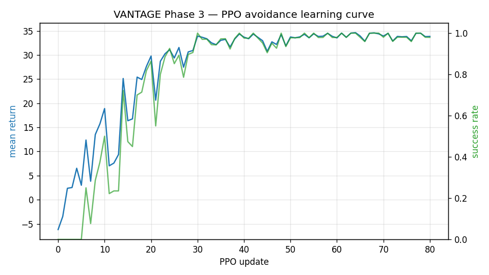
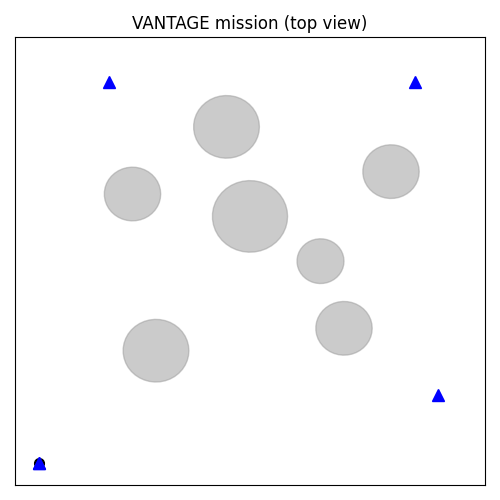

# VANTAGE

**Versatile Autonomous Navigation & Tracking in GPS-denied Environments**

A Python simulation project for quadrotor control, obstacle-aware planning, and reinforcement-learning collision avoidance. The implemented work includes a custom 3D rigid-body simulator, A*/RRT* planners, a cascaded controller, waypoint missions, and PPO trained in a separate simplified 2D environment.

The name describes the longer-term goal. The current implementation uses simulator ground-truth state and generated obstacles; it does **not** demonstrate camera/IMU-based GPS-denied navigation, visual SLAM, or flight on real hardware.

   

## Which simulator was actually used?

**The committed results come from custom Python simulations. Isaac Sim, Pegasus, and Isaac Lab were part of the original plan, but are not integrated into the implemented training or benchmark pipeline.**

| Component | What actually runs | Status / evidence |
|---|---|---|
| Control, 3D planning, and missions | Custom NumPy 6-DOF quadrotor dynamics, RK4 integration, spherical obstacles, and a cascaded PD controller | Implemented in [quadrotor.py](vantage/sim/quadrotor.py), [world.py](vantage/sim/world.py), and [follow.py](vantage/planning/follow.py); saved results in `results/` |
| RL training and evaluation | Custom 2D point-mass environment with direct velocity commands and synthetic lidar-style rays; Gymnasium-compatible API | Implemented in [avoidance_env.py](vantage/rl/avoidance_env.py); used by both PPO trainers |
| PX4 SITL + Gazebo | Optional installer, launcher, and MAVSDK fixed-waypoint script for Linux/WSL2 | Scaffold only. [DOCS.md](DOCS.md) and [realsim/README.md](realsim/README.md) say these scripts had not been run; no completed Gazebo/PX4 run is evidenced by the committed results |
| Isaac Sim / Pegasus / Isaac Lab | Original project-plan technologies | No integration or training results in this repository |

The 2D RL environment does **not** call the 3D quadrotor model. It updates position directly from the chosen velocity. The physics simulation is useful for control and planning experiments, but has no camera rendering, sensor-noise/estimation pipeline, or demonstrated sim-to-real validation.

The [mission GIF](results/phase4_mission.gif) is a Matplotlib animation of a simulated trajectory, not footage from Isaac Sim or Gazebo. The mission uses A* and the controller; it does not execute the learned PPO policy.

## How was the model trained? What dataset was used?

**No external dataset is loaded by the implemented training pipeline.** The learned component is a small PPO avoidance policy trained from scratch through trial and error in procedurally generated obstacle courses. It is not an image model, a pretrained vision-language-action model, or a policy trained from recorded drone flights.

Both [the NumPy trainer](scripts/phase3_train.py) and [the PyTorch trainer](scripts/phase3_train_torch.py) use `AvoidanceEnv(n_obstacles=6)`:

- **World:** a 10 x 10 m 2D area, fixed start at (1, 5), fixed goal at (9, 5), and six randomly placed circular obstacles with radii sampled from 0.4–0.8 m. Obstacle layouts change between episodes.
- **Input:** 20 numbers — two normalized goal offsets, two normalized velocity components, and 16 synthetic range readings with a 3 m sensing range. These readings are computed from geometry, not captured by a physical lidar or camera.
- **Output:** two continuous velocity commands, scaled to a maximum of 1.5 m/s per axis.
- **Experience:** the policy acts, the environment advances by 0.1 s, and the trainer collects observations, actions, rewards, and episode endings. These generated rollouts are the training data; there is no fixed downloaded dataset or human-labeled demonstration set.
- **Reward:** progress toward the goal, minus time and obstacle-proximity penalties; +20 for reaching the goal, -10 for a collision or leaving the area. Episodes last at most 200 steps.
- **Learning:** PPO with generalized advantage estimation (GAE), a clipped policy objective, value learning, an entropy term, and Adam. Separate policy and value networks each have two 64-unit tanh hidden layers.

### Training artifacts and provenance

| Run | Implementation | Committed artifacts / evidence |
|---|---|---|
| CPU policy | PPO and backpropagation implemented in NumPy | [phase3_policy.npz](results/phase3_policy.npz), [learning-curve CSV](results/phase3_curve.csv), and [curve plot](results/phase3_curve.png). The CSV contains update indices 0–80; its last training success rate is 0.98 |
| PyTorch policy | Separate PPO implementation using PyTorch; CUDA when available, CPU otherwise | [phase3_policy_torch.pt](results/phase3_policy_torch.pt) and [evaluation report](results/phase3_torch_eval.txt). The report records evaluation on an NVIDIA GeForce RTX 4050 Laptop GPU |

[DOCS.md](DOCS.md) records a GPU training run of 120 updates. The checked-in [Windows launcher](run_gpu_training.bat) specifies 120 updates x 3,000 steps = **360,000 environment transitions**. This is the documented launcher configuration; the complete training log is not committed. The PyTorch script's defaults are different: 200 updates x 4,000 steps. GPU use refers to the neural-network computation; the environment remains a Python/NumPy loop on the CPU.

The PyTorch evaluation uses 100 courses with seeds 5000–5099. The NumPy policy's A* comparison uses 40 courses with seeds 1000–1039. These are separate evaluations of separate checkpoints, not two scores from the same run. They use the same kind of generated environment as training, rather than an external real-world test dataset.

## Implemented architecture

```text
3D control / planning / mission experiments:
Generated spherical obstacles -> known occupancy grid -> A* or RRT*
                                                      |
                                                      v
                            Pure-pursuit follower -> cascaded PD controller
                                                      |
                                                      v
                            Custom RK4 quadrotor dynamics -> trajectory / metrics
                            (controller receives simulator ground-truth state)

Separate 2D learning experiment:
Random circular obstacles -> synthetic ranges + goal offset + velocity
                                                      |
                                                      v
                            PPO policy -> 2D velocity action -> AvoidanceEnv
                                                      |
                                                      v
                            Rewards / rollouts -> PPO updates -> saved weights
```

Current dependencies are Python 3.10+, NumPy, SciPy, Matplotlib, Gymnasium, and ImageIO, with optional PyTorch for the second trainer. See [pyproject.toml](pyproject.toml). [CI](.github/workflows/ci.yml) runs pytest; it does not run Isaac Sim, Gazebo, or the full benchmark/training sequence.

## Recorded results

These are the **committed historical results**, under the custom simulators' assumptions. They are not real-flight results or evidence of GPS-denied state estimation.

| Experiment | Recorded result | Source |
|---|---|---|
| Phase 1: hover / step tracking | 2.77 mm hover RMSE; 1.32 s step settling | [Control metrics](results/phase1_metrics.md) |
| Phase 2: A* vs RRT*, 15 generated worlds | Both 100% success, 0 recorded collisions; mean flown lengths 13.02 m / 13.80 m | [Planning metrics](results/phase2_metrics.md) |
| Phase 3: NumPy PPO vs A*, 40 generated worlds | PPO: 97.5% success, 0% recorded collisions; A*: 100% path-finding success | [Comparison CSV](results/phase3_metrics.csv) |
| Phase 3: PyTorch PPO, 100 generated courses | 96% success, 4% collision, 59.4 mean steps | [PyTorch evaluation](results/phase3_torch_eval.txt) |
| Phase 4: A* waypoint mission | 31.17 m flown vs 31.15 m planned; 0 recorded collisions | [Mission report](results/phase4_mission_report.json) |

The Phase 3 comparison gives A* the full map and scores its planned path; PPO is stepped through the environment using local observations. It is not an identical sensing/control comparison. Also, `phase3_benchmark.py` **sums PPO inference time over each episode**. The older “0.68 ms/decision” claim and the per-decision labels in the generated report/dashboard are therefore incorrect; the CSV's 0.675 ms value is mean accumulated policy inference time per episode, versus 52.5627 ms for A* map construction and search. It is not a validated per-decision speed comparison.

Collision results reflect the current simplified checks. In particular, the RL environment checks the point position against obstacle surfaces and bounds; its `robot_radius` setting is not applied to that collision test. These rates do not establish full-airframe clearance or real-world safety.





The Phase 4 mission starts at an already-airborne home waypoint, visits three points, and returns home. The saved mission is not an end-to-end takeoff-to-landing or camera-based inspection demonstration.

## Getting started

```bash
git clone https://github.com/samisaliveagain/vantage.git
cd vantage
python -m pip install -e .
python -m pip install pytest
python -m pytest -q

# Evaluate the existing NumPy checkpoint and regenerate simulation outputs.
python scripts/phase1_hover.py
python scripts/phase2_planning_benchmark.py
python scripts/phase3_benchmark.py
python scripts/phase4_mission.py
python scripts/run_all_benchmarks.py
```

The last script aggregates existing result files into the report and dashboard. Its legacy Phase 3 timing labels have the limitation described above.

To train a new NumPy policy (overwrites the NumPy checkpoint and learning curve):

```bash
python scripts/phase3_train.py --updates 120 --steps 4000
# Add --resume to load the existing weights and append to the curve.
```

To train and evaluate the separate PyTorch policy:

```bash
python -m pip install -e ".[gpu]"
python scripts/phase3_train_torch.py --updates 120 --steps 3000
python scripts/phase3_eval_torch.py
```

PyTorch selects CUDA if available; otherwise it uses the CPU. Training overwrites its checkpoint, and evaluation overwrites its report. To evaluate the committed PyTorch weights without retraining, run only the install and evaluation commands. Environment seeds are explicit, but the PyTorch trainer does not seed its network initialization or action-sampling RNG, so retraining is not guaranteed to reproduce the recorded 96%.

For the separate, unvalidated PX4/Gazebo setup, see [the runbook](realsim/00_RUNBOOK.md). Its MAVSDK example sends fixed waypoints; the VANTAGE planners and PPO policy have not been connected to that script.

## Repository layout

```text
vantage/
  sim/          # Custom 3D dynamics and obstacle world
  control/      # Cascaded PD controller
  planning/     # A*, RRT*, and path following
  rl/           # Separate 2D avoidance environment and NumPy PPO
  missions/     # A* waypoint mission runner
  utils/        # Metrics and report helpers
scripts/        # Experiments, training, evaluation, and plotting
tests/          # Automated tests
results/        # Saved checkpoints, metrics, plots, and GIF
realsim/        # Unvalidated PX4/Gazebo setup and MAVSDK waypoint example
docs/           # Original project plan and generated benchmark report
.github/workflows/ # Test CI
```

[DOCS.md](DOCS.md) provides a longer file-by-file explanation and historical development notes. For the distinctions between 2D training, 3D simulation, and planned integrations, use the implementation status above.

## Future work — not implemented or validated

- Run PX4 SITL + Gazebo, connect the planners/policy, and save flight logs and reproducible results.
- Add camera/IMU simulation, perception, VIO/SLAM, and sensor-derived mapping.
- Train/evaluate avoidance with quadrotor dynamics, sensor noise, and realistic collision geometry.
- Evaluate broader domain randomization and sim-to-real transfer.
- Consider Isaac Sim / Pegasus / Isaac Lab as a future integration.

ROS 2 bridges, YOLO/depth models, TensorRT, EKF2 visual-odometry fusion, ESDF mapping, MPC/minimum-snap, and behavior-tree missions were design goals, not implemented capabilities in the current package.

## License

MIT © samisaliveagain
